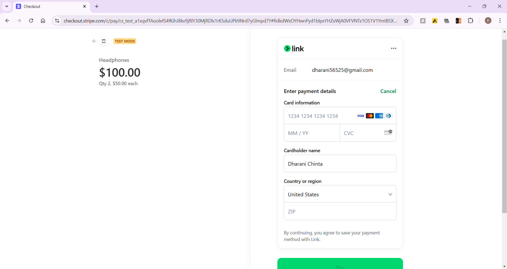

# Stripe Payment Gateway Integration with Spring Boot

Welcome to the **Stripe Payment Gateway Integration** project! This project demonstrates how to integrate **Stripe**, a leading payment gateway, into a **Spring Boot application**. It provides a comprehensive guide and implementation for developers to incorporate payment processing features into their applications, such as e-commerce platforms or subscription-based services.

## Project Overview

This project showcases the following:
- Step-by-step integration of Stripe with Spring Boot.
- Backend implementation for handling payment sessions using Stripe APIs.
- Frontend integration using **Thymeleaf** for UI-based checkout and payment processing.
- Test mode configurations for safe and error-free development.

## Features

- **Spring Boot Backend**:
  - REST APIs to handle payment requests.
  - Integration with Stripe’s SDK for secure transactions.
  - Configurable properties for secret and publishable keys.

- **Frontend UI**:
  - Dynamic product catalog with quantity-based pricing.
  - Payment button triggering the Stripe Checkout process.
  - Success and cancellation pages after transaction processing.

- **Test Mode**:
  - Allows testing payments without real money using Stripe's test environment.

## Tech Stack

- **Backend**: Java, Spring Boot (3.4.0)
- **Frontend**: Thymeleaf, JavaScript
- **Stripe SDK**: Stripe Java Library
- **Build Tool**: Maven
- **Dependencies**: Spring Web, Lombok, Thymeleaf

---

## Getting Started

### Prerequisites

1. **Java Development Kit (JDK 21)**.
2. **Maven** for project management.
3. A **Stripe Account** to obtain API keys (secret key and publishable key).
4. **Postman** (optional) for testing backend APIs.

### Installation

1. Clone this repository:
   ```bash
   git clone https://github.com/your-repo/springboot-stripe-integration.git
   cd springboot-stripe-integration
   ```

2. Configure Stripe keys in `application.properties`:
   ```properties
   stripe.secret-key=sk_test_xxxxxxxx
   stripe.publishable-key=pk_test_xxxxxxxx
   ```

4. Run the application:
   ```bash
   .\gradlew bootRun
   ```

5. Open a browser and navigate to `http://localhost:8080`.

---

## API Endpoints

### **Checkout API**
- **URL**: `/product/v1/checkout`
- **Method**: POST
- **Request Body**:
  ```json
   {
      "amount": 1000,
      "quantity": 2,
      "name": "Mobile",
      "currency": "USD"
   }
  ```
- **Response**:
  ```json
  {
    "status": "SUCCESS",
    "message": "Payment session created",
    "sessionId": "sess_abc123",
    "sessionUrl": "https://checkout.stripe.com/c/pay/sess_abc123"
  }
  ```

---

## Project Structure

### **Backend**
1. **Controller**:
   - Handles incoming requests and invokes service methods.
2. **Service**:
   - Communicates with Stripe API to create payment sessions.
3. **DTOs**:
   - `ProductRequest`: Request structure for payment details.
   - `StripeResponse`: Response structure for payment results.

### **Frontend**
- **Templates**:
  - `index.html`: Displays the product catalog.
  - `success.html`: Confirmation page after successful payment.
  - `cancel.html`: Cancellation page for aborted transactions.

- **Static Resources**:
  - Images for the product catalog.
  - JavaScript for handling API calls and Stripe checkout redirection.

---

## Usage

1. **Start the Application**:
   Run the project and open the browser at `http://localhost:8080`.

2. **Select a Product**:
   Choose a product and quantity from the catalog.

3. **Proceed to Checkout**:
   Click on the checkout button to initiate payment. 

4. **Complete the Payment**:
   Use Stripe’s test card (`4242 4242 4242 4242`) to simulate a successful payment.

5. **Verify Transaction**:
   Check the Stripe dashboard to see the transaction logs.

---

## Sample Screenshots

### Product Catalog


### Checkout Page


### Success Page


### Stripe Dashboard


---

## Learnings

This project helped in:
- Understanding Stripe API and its integration with Spring Boot.
- Implementing secure and scalable payment processing features.
- Building dynamic UI with Thymeleaf and integrating it with backend APIs.

---

## Future Enhancements

1. **Currency Converter**:
   Add logic to support multiple currencies dynamically.
2. **Error Handling**:
   Enhance exception handling for various edge cases.
3. **User Authentication**:
   Secure endpoints and sessions with user authentication.
4. **Database Integration**:
   Store transaction details in a database for auditing purposes.

---

## License

This project is licensed under the MIT License. See `LICENSE` for more information.

---

Feel free to explore, modify, and integrate this project into your applications! 🚀